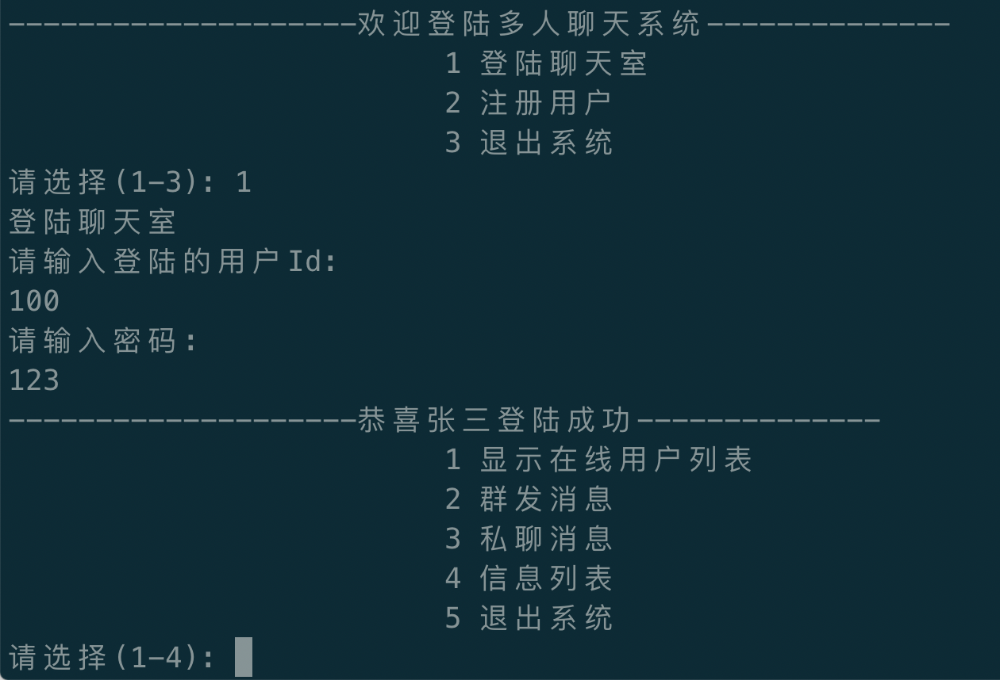
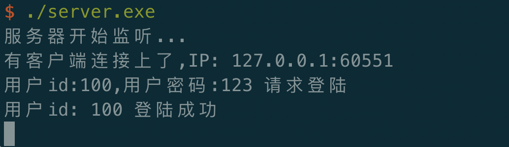

# 基于go语言开发的TCP聊天室(网络编程)

## 作用
为了学习网络编程，用`go`语言开发的，基于`TCP`协议的`网络编程`-`聊天室`。作为一个`TCP`网络编程开发的案例，同时也作为`C/S`结构项目开发的案例参考。


## 外观

低调复古的界面，让人回味无穷，百看不厌。

### 客户端



### 服务端



## 实现功能

- 基于TCP的网络编程

- 发包接包都进行了长度校验

- 支持群聊

- 支持点对点单聊

- 实时在线用户列表

- 多重登录下线

- 合理的目录，文件划分，面向对象编程

## 编译

`exe`文件夹里依旧放入了已经编译好的exe文件。如果想自己编译，那么，可以把项目放在 `GOPATH`对应的文件夹下。

然后编译

```
go build -o "编译后的名称" "相对于GOPATH的路径"
//比如
go build -o server.exe go_code/chatroom/server/main
```

## 使用

确认本机已经安装了`redis`,即可正常使用